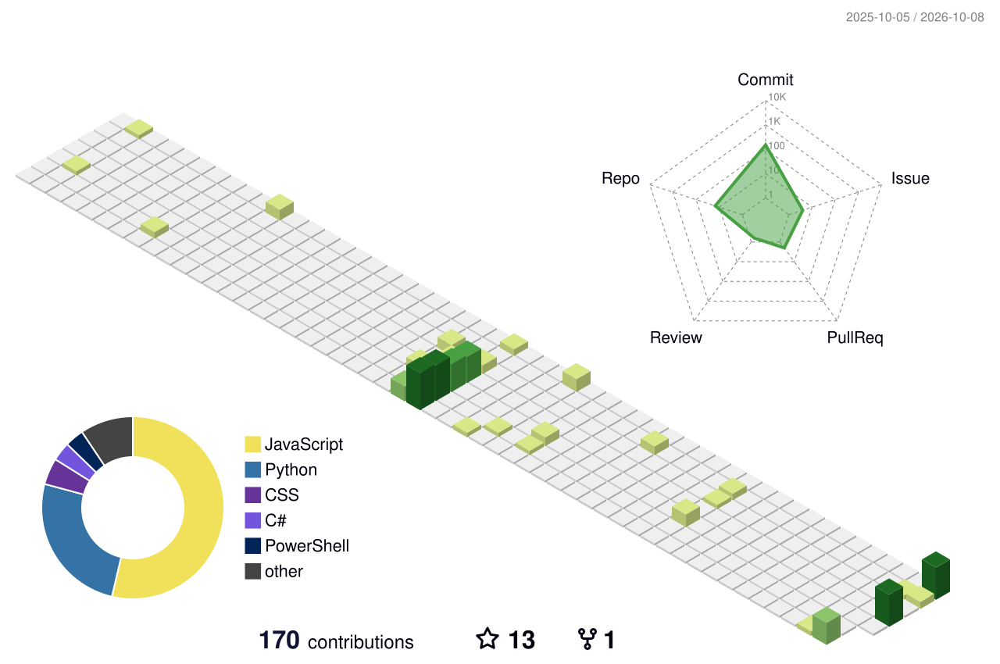

# Annoyingwinter

<!-- 在这写一句自我介绍，例如：CS 在读，方向 XX。写好后删除本行注释。 -->

<!-- 贪吃蛇：每日自动重新生成的贡献图动画 -->
<picture>
  <source media="(prefers-color-scheme: dark)" srcset="https://raw.githubusercontent.com/Annoyingwinter/Annoyingwinter/output/github-snake-dark.svg" />
  <source media="(prefers-color-scheme: light)" srcset="https://raw.githubusercontent.com/Annoyingwinter/Annoyingwinter/output/github-snake.svg" />
  
</picture>

<!-- 3D 贡献图：每日重建 -->

<!-- 电子鸡：状态由最近 90 天公开提交计算，断更 21 天会死 -->
<picture>
  <source media="(prefers-color-scheme: dark)" srcset="https://commitchi.pages.dev/api/card?u=Annoyingwinter&theme=dark" />
  
</picture>

<!-- 公开慢棋：任何人可在 issue 中走子 -->
♟️ [play-chess](https://github.com/Annoyingwinter/play-chess) · 提 issue 即可走子
